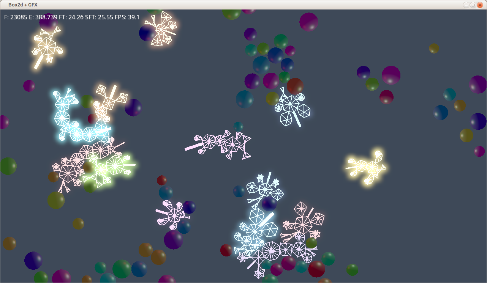
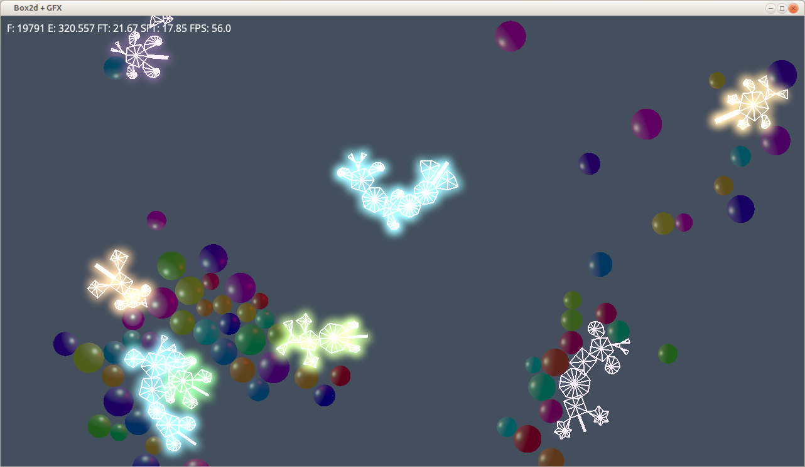

Having fun with Rust, gfx, GLSL and box2d.

I got HDR bloom.

Some procedurally generated bioids:

Left mouse click: create bioid.
Left mouse drag: drop some balls.
Right mouse click, drag: move light.
