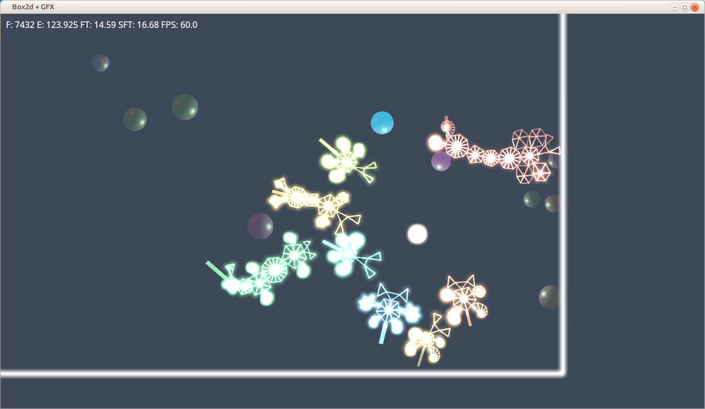
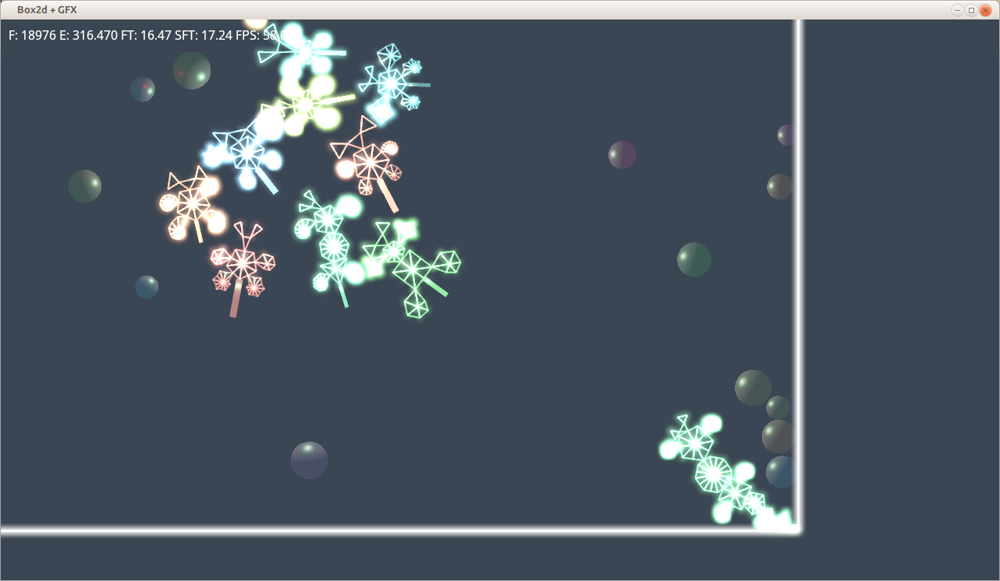

## Rust-oids

This project started as a test bed for https://github.com/gfx-rs/gfx and box2d wrapper https://github.com/Bastacyclop/rust_box2d. It gradually evolved to a sandbox emulator for little artificial things which were, possibly aptly, renamed "rust-oids". I'm now looking into breeding/genetic algorithms and possibly simple neural networks.

Eventually I plan to plug in some sort of gameplay and release as a free game. Strictly evening/weekend toy project: don't hold your breath.

Feedback welcome, feel free to post issues.

## Screenshots

Some procedurally generated rust-oids:

## Prerequisites

I've only built on Ubuntu GNU/Linux but I've got reports of successful builds on Mac OS + Homebrew. Aside from the full Rust toolchain, the following packages are required:

- libbox2d-dev
- libfreetype6-dev

## How to play

- Right mouse click: new rustoid.
- Ctrl + Right mouse click: new ball (inert obstacle).
- Left mouse click/drag: move light.
- V,B: set background tone
- K,L: change light intensity
- 0, Home: reset camera pan
- Arrows: camera pan

Keywords: rust rustlang gfx box2d wrapper2d hdr msaa alpha tonemapping shader fragment pixel vertex geometry pso testbed ai alife

