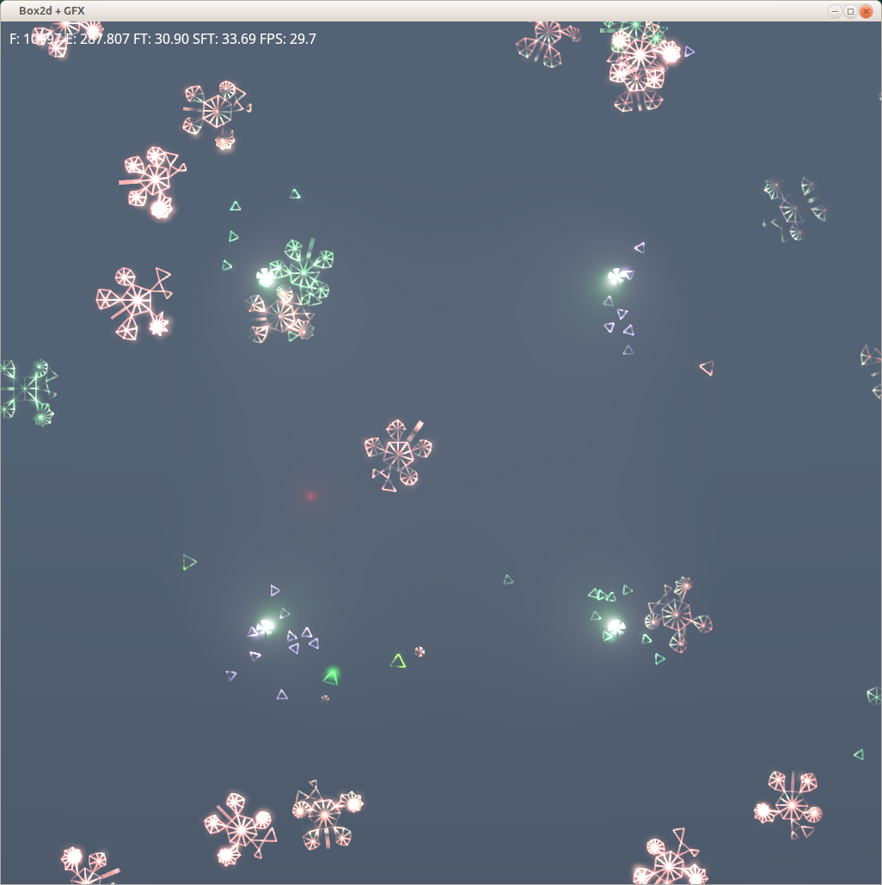
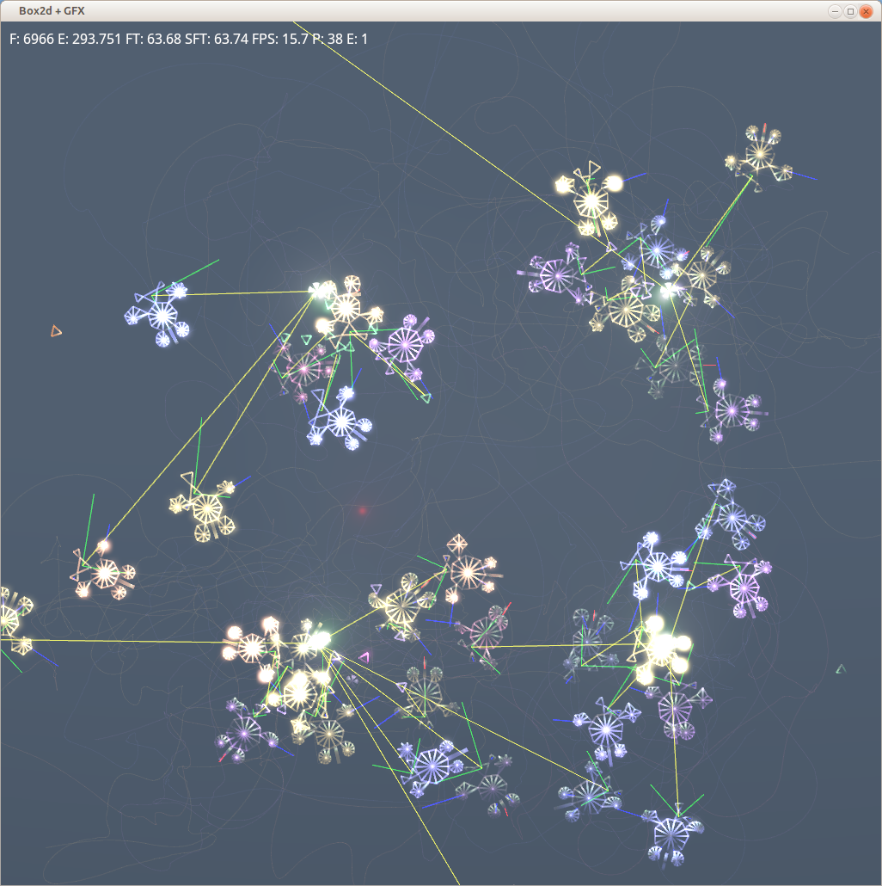

## Rust-oids

UPDATE 19/10/2017:
  Runs in debug mode again. sRGB surface still disabled.

  Tested on Devuan Ceres latest.

## Simulation

Here's roughly how the simulation works. There are 3 types of agents in the world:

### Resources. 
These are spawned at a fixed rate by Emitters. Their lifespan is very short and their only purpose is to provide nourishment for the Minions. Minions can detect nearby Resources with their sensor, and detect the nearest Emitters at any distance.

### Minions. 
These are the little rustoid critters.
- Each Minion shape and behaviour is determined by its, practically unique, **genotype**, which is basically just a string of bits.
- Body plan, limb geometry and mass distribution are fully simulated via the box2d **physics** engine.
- Body plan, gender, appearance, and brain aspects of the **phenotype** of each Minion are fully determined by its genetic code.
- Each Minion's **brain** is implemented via a simple 3 layer neural network. Brain has no learning capabilities, all behaviour is hardcoded at birth by genotype alone.
- Each Minion has a **sensor** to detect nearby Resources and the nearest Emitter, among other variables.
- Up to 4 **inputs** from the **sensor** determine the **outputs** of the brain which enable **actuators** if their value exceed certain **personality**-dependent **thresholds**. Left and right **rudders** which exert pull, **thrusters** push, and a linear **brake** reduces forward speed.
- Each action by a Minion, including waiting idle and reproducing, consumes a certain amount of **energy**. When energy is depleted, the Minion **dies** and some of its body is released back as Resources.
- Minions who **eat** resources can top-up their energy pool, survive longer and **reproduce** via **spores**.
- Minions who are unsuccessful at finding and eating food will not leave offspring driving their lineage **extinct**. 

### Spores.
- The little 5-lobed balls produced by the Minions by means of which they **reproduce**.
- During reproduction, the genotype is transmitted but the process introduces a variable number of **mutations**. Each mutation flips a random bit of the genotype.
- After a short time, Spores **hatch** into Minions.
- If an unfertilized Spore is touched by a Minion of a different **gender**, of which there are four, it acquires its genetic material and the resulting Minion will have a gene which is a **crossover** of the two.

The intriguing bit about all of this is that AI, body shape and brain are **bred** via *artificial natural selection* - for want of a better name. Practically all observed behaviour is **emergent**.

Eventually I plan to plug in some sort of gameplay and release as a free game. Strictly evening/weekend toy project: don't hold your breath.

## Feedback
- feel free to post [issues on GitHub](https://github.com/itadinanta/rust-oids/issues)
- also send me interesting gene pools (F6 to get snapshots, see instructions below)

## Acknowledgements

This project started as a test bed for the Rust language and toolchain, [GFX](https://github.com/gfx-rs/gfx) and [box2d wrapper](https://github.com/Bastacyclop/rust_box2d), and could have not existed without those.

## Screenshots

Some rust-oids competing for territory and resources:





## Prerequisites

I've only built on Ubuntu GNU/Linux but I've got reports of successful builds on Mac OS + Homebrew. Since adding MSAA a month or so ago, the OSX build panics at launch.

Aside from the full Rust toolchain, the following packages are required:

- libbox2d-dev
- libfreetype6-dev

## Build/run

- Clone this repo and ```cd`` into its root
- ```cargo run --release``` to run starting with the default gene pool
- ```cargo run --release -- <gene_pool_file.csv>``` to run starting with a snapshotted gene pool (DDDDMMYYY_hhmmss.csv).

## How to play

- Right mouse click: new rustoid from current gene pool.
- Ctrl + Right mouse click: new random rustoid.
- Left mouse clik: select minion for tracing
- Left mouse click/drag: pan.
- Z: deselect minion for tracing
- D: disable tracing of target and trajectories
- F6: snapshot current gene pool into the **resources** folder
- F5: reload shaders
- V,B: set background tone
- K,L: change light intensity
- 0, Home: reset camera pan
- Arrows: camera pan

## Status line indicators

The status line at the top of the screen contains the following runtime stats: 

- F: Frame #
- E: Elapsed time since start in seconds
- FT: Last frame duration in milliseconds
- SFT: Average frame duration of the last 120 frames (step)
- FPS: Average fps of the last 120 frames
- P: Population size
- E: Extinction index - increased every time the whole population dies off

## Keywords

rust rustlang testbed ai alife ann neural network genetic algorithm gfx box2d wrapper2d hdr msaa alpha tonemapping shader fragment pixel vertex geometry pso gamedev
